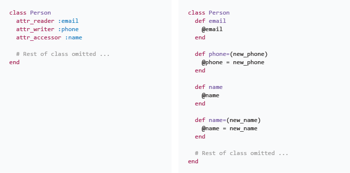

# Ruby Drill: Accessor Methods

## Summary
We write classes and then make instances of those classes.  Each instance holds a unique set of data (i.e., has a unique state).  If we created a `Person` class, we could make individual instances of the class—each with a unique name, phone number, e-mail address, etc.  In this `Person` class example, we would refer to name, phone number, and e-mail address as *attributes*, and we store their values in instance variables.

### Readers and Writers, Getters and Setters
We often want our objects to be able to share their attributes (i.e., share the values of their instance variables).  For example, we can ask an instance of the `Person` class what its name is, what its phone number is, etc.  Sometimes we also want to make it possible to reassign an object's attributes—for example, changing an object's name.

To make it possible for an object to share the values of its attributes or to have them reassigned, we create *accessor methods*.  Methods that return the value of an attribute are ofter referred to as reader or getter methods.  Methods that reassign a value are known as writer or setter methods.

### Creating Accessor Methods in Ruby
  
*Figure 1*.  Short-hand and long-hand approaches to defining accessor methods.

As mentioned, our Ruby accessor methods will either return or reassign the values of an object's attributes.  We could write methods to accomplish either of these, as can be seen in the example code on the righthand side of Figure 1.  However, creating attribute accessor methods is so common that Ruby provides a set of methods which will generate them for us:  reader methods, writer methods, or both.  These methods are utilized in the lefthand side of Figure 1, and they provide the same set of methods that were written long-hand on the right-hand side.

*Note:*  This [Stack Overflow answer](http://stackoverflow.com/questions/5046831/why-use-rubys-attr-accessor-attr-reader-and-attr-writer) offers more information on these methods.

##Releases

###Release 0
Read over the Ruby program provided until you understand the basic structure. You can load it into IRB or [PRY](http://pryrepl.org/) and play around with it if you'd like.

Do not change the code, just write tests for each of the methods in Company and Employee. We'll use these tests as _regression tests_ in Release 1. They'll ensure that our refactor doesn't change the behavior of our classes.

###Release 1 : Replace with attr_helpers
Identify which methods could be replaced with an `attr_reader`, `attr_writer`, or `attr_accessor` helper and do it.

This is a refactor that doesn't change behavior, so you shouldn't need to change your tests in this release. In fact, they'll alert you to any mistakes you make in the refactor.

##Resources

* [Ruby Accessor Methods](http://stackoverflow.com/questions/5046831/why-use-rubys-attr-accessor-attr-reader-and-attr-writer)
